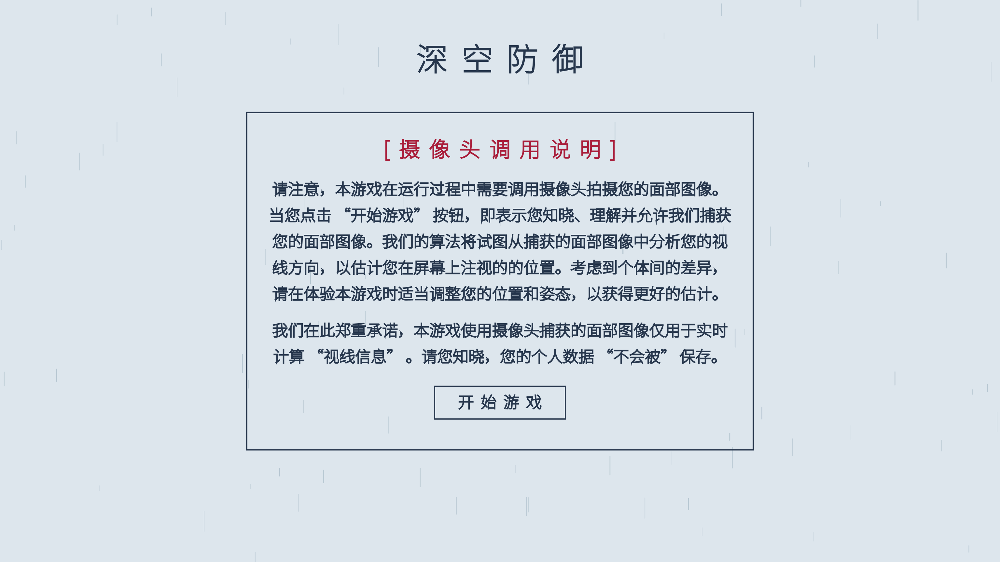
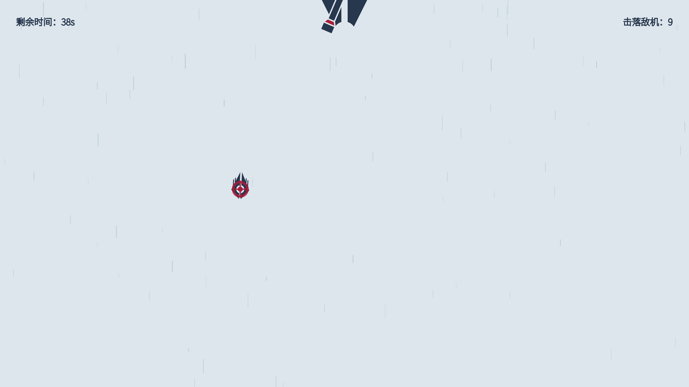
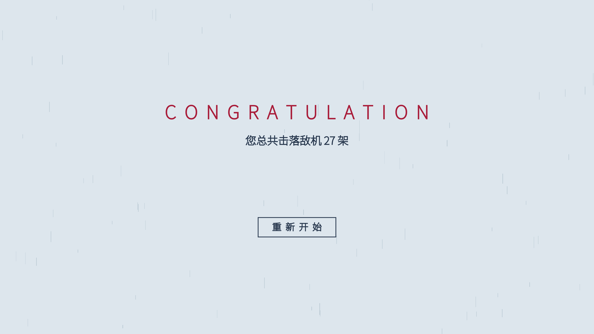

# Gaze Point Estimation (Demo)

A demo for the application of PoG (Point-of-Gaze) Estimation. Model Trained using this codebase: [gaze-point-estimation-2023](https://gitee.com/elorfiniel/gaze-point-estimation-2023).

| Intro | Game | Outro |
| -------------- | -------------- | -------------- |
|  |  |  |

## Setup

The demo consists of a Python backend (server) and a JavaScript frontend (client) that exchange data using the WebSocket API. To run the demo, please follow these steps:

1. Install the requirements for the Python backend.
2. Start the python backend (`estimator/estimator.py`).
3. Visit the hosted demo webpage (`sketch/demo.html`).

The following cheatsheet demonstrates how you can setup and run this demo from the command line. The latest update integrates an http server in the backend, which serves the frontend on `http://localhost:5500` by default. Furthermore, the server will try opening the demo page `demo.html` automatically in the default browser on successful start.

### Install Dependencies

```shell
# create a python virtual environment for dependencies
python -m venv --upgrade-deps venv

# activate the virtual environment
venv/Scripts/activate.bat # (windows: cmd)
venv/Scripts/Activate.ps1 # (windows: pwsh)
source venv/bin/activate  # (linux / mac)

# install required dependencies using pip
pip install -r estimator/requirements.txt
```

Now, you'll have the environment properly setup.

### Download Resources

Follow instructions in `estimator/checkpoint/README.md` (for ONNX model), `sketch/assets/README.md` (for font file) and `estimator/resources/README.md` (for optional external resources) to download or prepare the required resources before running the demo.

### Run the Demo

```shell
# start the python backend (aka. the server)
# the frontend will be served automatically
cd estimator && python estimator.py --mode server
```

If everything goes well, [the demo page](http://localhost:5500/demo.html) will be opened in the browser.

## Configuration

Different laptops comes with different screen size and resolution. The default configuration assumes running the demo on a `lenovo yoga c740` laptop. If you are using a different laptop, you can adjust the configuration in `estimator/estimator.toml` to match your screen size and resolution. Check out the comments in the configuration file for more details. By modifying the configuration, you can adjust the server to match your own use case.

Most notably, you may need to adjust the `topleft_offset` (measured in centimeters), `screen_size_px` (measured in pixels) and `screen_size_cm` (measured in centimeters) in `estimator/estimator.toml` according to your screen size and resolution.

## Record Mode

The demo uses **the record mode** to capture the PoG from the javascript frontend and the face image from the python backend. This functionality is intended for the collection of [GazeCapture](https://gazecapture.csail.mit.edu/)-like datasets, so that the model can be trained and improved on the captured data.

To enable the record mode, open configuration `estimator/estimator.toml`, then adjust the `record` field in the `server` table by specifying a non-empty output directory using `path`. For instance, you can use the following config to record the PoG and face image to `demo-capture` directory:

```toml
[server]
record = { path = 'demo-capture', inference = true }
```

The above config will create a `demo-capture` directory and save the captured PoGs and face images in the corresponding subfolders, named using either the timestamp or the custom name specified in the frontend. Each subfolder contains a list of images named using format `<frame_count> <image_label>.jpg`, where the `<image_label>` is a string that indicates the image label, given by the predictor and the groundtruth (namely, `<px>_<py>_<gx>_<gy>`).

## Bundled App

The demo can be packaged into a standalone application using [PyInstaller](https://www.pyinstaller.org), following these steps:

```shell
# make sure you have the required dependencies installed
cd estimator && pip install -r requirements.txt

# bundle the application using the "bootstrap.spec"
pyinstaller --distpath ../bundle/dist --workpath ../bundle/build bootstrap.spec

# copy the configuration file to the output directory
cp config.toml ../bundle/dist/config.toml
```

The above command will use the `bundle` directory during the bundling process. The bundled application locates in `bundle/dist`, and can be run directly from the command line, eg `./bootstrap.exe`. An extra config file `config.toml` overrides the default configuration in `estimator/estimator.toml`, which has been packaged into the application.

For implementation details about the bundling process, take a look at the `bootstrap.spec` file. You may also find these resources useful: 1. [Using PyInstaller](https://pyinstaller.org/en/stable/usage.html), 2. [Using Spec Files](https://pyinstaller.org/en/stable/spec-files.html), 3. [Runtime Information](https://pyinstaller.org/en/stable/runtime-information.html).

## Note

The demo converts the estimated PoG to a 2D point on canvas using the following steps:

1. `Camera` to `Screen`: convert the estimated PoG from the camera coordinate frame (centered at the pinhole camera, $x_+$: right, $y_+$: up) to the screen coordinate frame (centered at the top-left corner of the screen, $x_+$: right, $y_+$: down).
2. `Screen` to `Canvas`: convert the estimated PoG from the screen coordinate frame to the canvas coordinate frame (centered at the top-left corner of the visual viewport, $x_+$: right, $y_+$: down), which also involves the conversion from centimeters to pixels.
3. Adjustments: The PoG is adjusted to account for the visual viewport's movement, such as when the user "drag and move" the browser window.

Run the demo in a browser window. No fullscreen mode nor fixed window location are required. Furthermore, the demo has only been **tested successfully in Edge** while Chrome presents wrong measurement of the window size.
